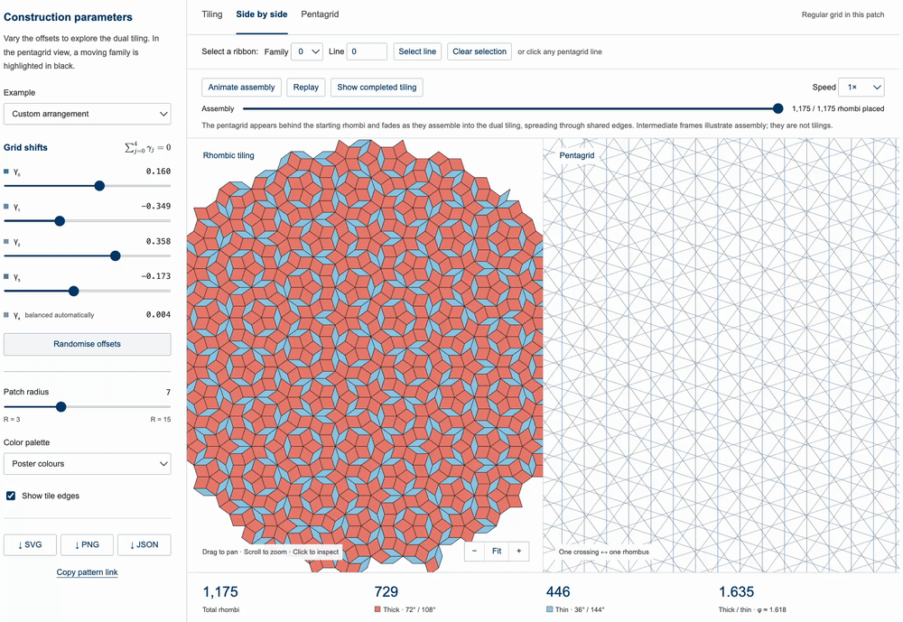
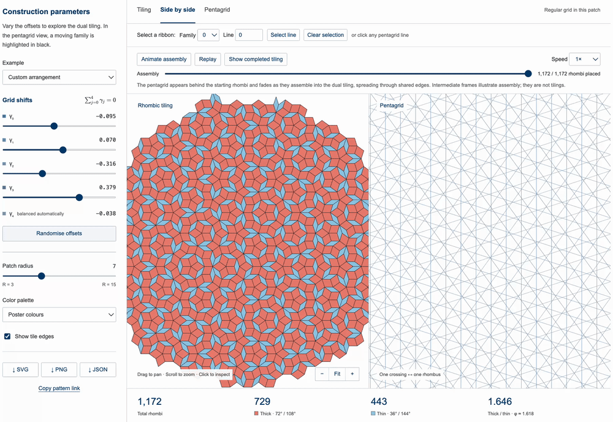
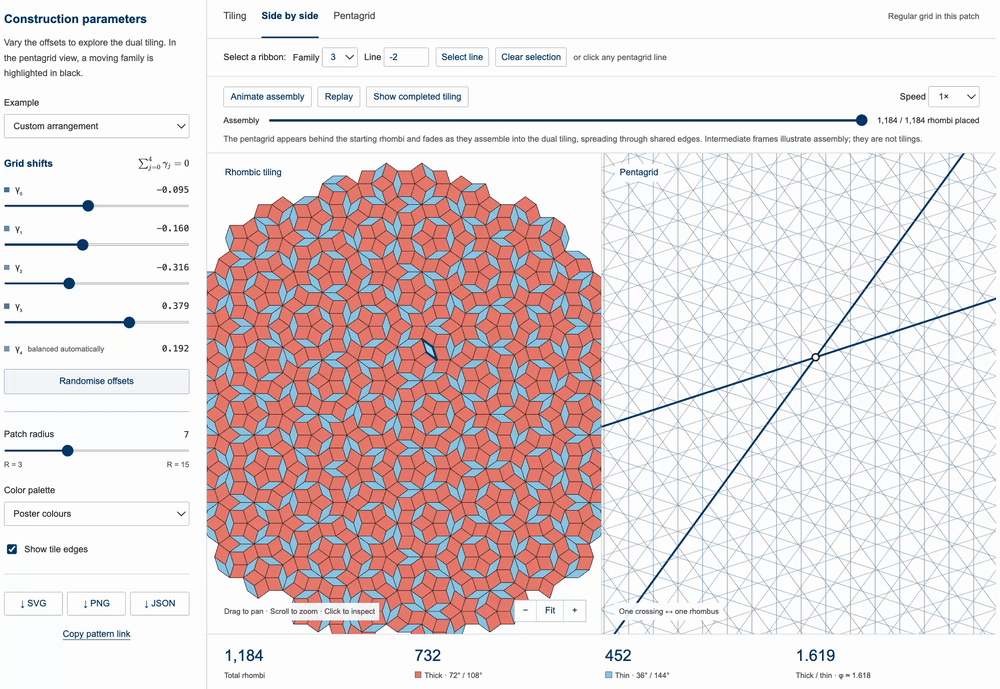
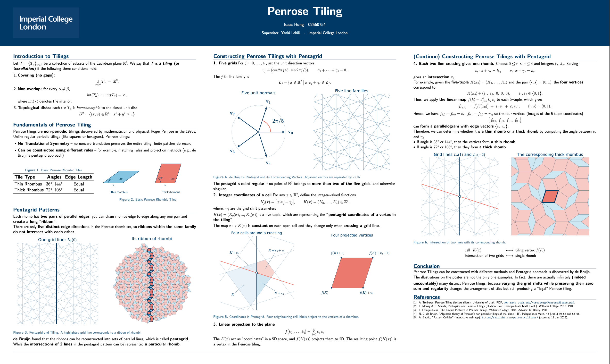

# Penrose Tiling

An interactive exploration of **Penrose tilings using de Bruijn's pentagrid construction**.

[**Live Demo**](https://ish24cho.github.io/Penrose-Tiling/) | [**Research Poster**](Penrose_Tiling_Poster.pdf)

## Overview

This project visualises how a Penrose tiling can be constructed from de Bruijn's **pentagrid method**.

The interactive website lets you modify the pentagrid and immediately see the corresponding Penrose tiling, explore the relationship between grid lines and rhombi, highlight ribbons, and watch the tiling assemble from a selected tile.

## Interactive Website

### Explore the Pentagrid

Adjust the pentagrid offsets and see how the corresponding Penrose tiling changes in real time.



### Highlight Ribbons

Click a pentagrid line to highlight the full ribbon of rhombi associated with that line.



### Assembly Animation

Select a rhombus and watch the Penrose tiling assemble outward through neighbouring tiles.



[**Try the Interactive Website →**](https://ish24cho.github.io/Penrose-Tiling/)

## Features

- **Interactive pentagrid** — adjust the five grid families and generate different Penrose tilings
- **Dual tiling view** — compare the pentagrid with its corresponding rhombus tiling
- **Ribbon highlighting** — select a pentagrid line and reveal its associated ribbon of rhombi
- **Rhombus selection** — inspect individual tiles and choose an assembly starting point
- **Assembly animation** — watch the tiling form outward from a selected rhombus
- **Export** — save the completed tiling as SVG, PNG or JSON

## Mathematics

The construction follows de Bruijn's pentagrid method.

Five families of parallel lines are arranged at directions separated by

```math
\frac{2\pi}{5}.
```

Each line is indexed within its family. Intersections between pairs of pentagrid lines determine rhombi in the corresponding dual Penrose tiling.

The interactive website visualises this relationship directly.

## Research Poster

The accompanying poster explains the mathematical construction and the connection between the pentagrid and Penrose tilings in more detail.

[](Penrose_Tiling_Poster.pdf)

[**View Full Research Poster →**](Penrose_Tiling_Poster.pdf)

## Repository

```text
Penrose-Tiling/
├── README.md
├── Penrose_Tiling_Poster.pdf
├── index.html
├── assets/
│   ├── poster-preview.png
│   ├── pentagrid-demo.gif
│   ├── ribbon-demo.gif
│   └── assembly-demo.gif
└── website/
```

## Research

**Author:** Isaac Hung  
**Supervisor:** Yanki Lekili  
**Institution:** Imperial College London